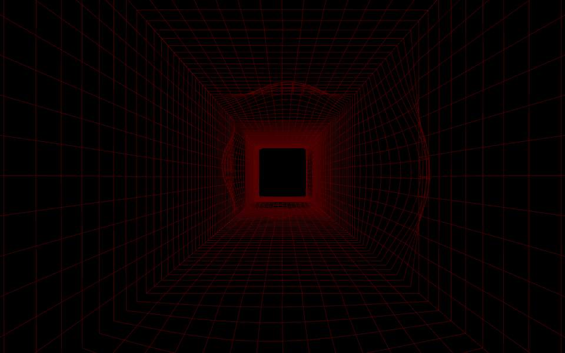

# Re_fit
(note: this project has been developed as a part of 3 days workshop at DfPI)

A responsive installation inclusive of all ages that invites interaction with a projected visualization of a replicated environment. The participant is invited to identify the environment copy that most closely responds to their own motion.

The projection installation entitled ‘Re-fit’, will aim to question the process of adaptation that individuals undergo when encountering an expected environment or attempting to re-acquaint themselves with a change in their environment. The subject of the installation suggests that this is a neural process or a process by which the brains works that can go awry or become affected by the environment. 

## Material
* requires toxiclib library in processing
* kinect windows SDK

## Video
https://vimeo.com/346115808
